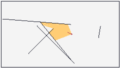

# 2D Raycasting in TIC-80

Demo of 2D raycasting in the TIC-80 fantasy console, using Lua.

Based on this video tutorial by Daniel Shiffman: [Coding Challenge #145: 2D Raycasting](https://www.youtube.com/watch?v=TOEi6T2mtHo)



## Code

```lua
-- author:  Aleksandr Hovhannisyan
-- desc:    Lua implementation of this tutorial by Daniel Shiffman: https://www.youtube.com/watch?v=TOEi6T2mtHo
-- site:    aleksandrhovhannisyan.com
-- license: MIT License
-- version: 0.1
-- script:  lua

function BOOT()
    Color = {
        BLACK = 0,
        RED = 2,
        YELLOW = 4,
        WHITE = 12
    }
    Screen = {
        WIDTH = 240,
        HEIGHT = 136,
        PADDING = 2
    }
    Btn = {
        UP = 0,
        DOWN = 1,
        LEFT = 2,
        RIGHT = 3
    }

    Vector = {}
    Vector.__index = Vector

    -- Creates a new instance of a vector
    function Vector:new(x, y)
        local instance = setmetatable({}, Vector)
        instance.x = x
        instance.y = y
        return instance
    end

    -- Returns the length (magnitude) of this vector
    function Vector:length()
        return math.sqrt(self.x ^ 2 + self.y ^ 2)
    end

    -- Normalizes this vector so it has a length of 1
    function Vector:normalize()
        local length = self:length()
        self.x = self.x / length
        self.y = self.y / length
    end

    -- Scales this vector by the given scalar
    function Vector:scale(scalar)
        self.x = self.x * scalar
        self.y = self.y * scalar
    end

    function Vector:fromAngle(angleRadians)
        local x = math.cos(angleRadians)
        local y = math.sin(angleRadians)
        return Vector:new(x, y)
    end

    Ray = {}
    Ray.__index = Ray

    -- Creates a new ray at the specified position, pointing in the specified direction
    -- as an angle in radians relative to the horizontal.
    function Ray:new(position, angleRadians)
        local instance = setmetatable({}, Ray)
        instance.position = position
        instance:setAngle(angleRadians)
        return instance
    end

    function Ray:setAngle(angleRadians)
        self.angle = angleRadians
        self.direction = Vector:fromAngle(self.angle)
        self.direction:normalize()
    end

    -- Casts this ray onto the specified boundary and returns the intersection
    -- point and distance to the intersection, if one is found.
    -- https://en.wikipedia.org/wiki/Line%E2%80%93line_intersection#Given_two_points_on_each_line_segment
    -- https://stackoverflow.com/questions/563198/how-do-you-detect-where-two-line-segments-intersect/565282#565282
    function Ray:cast(boundary)
        -- Boundary, L1
        local x1 = boundary.a.x
        local y1 = boundary.a.y
        local x2 = boundary.b.x
        local y2 = boundary.b.y

        -- Ray, L2
        local x3 = self.position.x
        local y3 = self.position.y
        local x4 = self.position.x + self.direction.x
        local y4 = self.position.y - self.direction.y

        -- Zero implies the two lines are parallel and never intersect
        local denominator = (x1 - x2) * (y3 - y4) - (y1 - y2) * (x3 - x4)

        if denominator == 0 then
            return nil
        end

        local t = ((x1 - x3) * (y3 - y4) - (y1 - y3) * (x3 - x4)) / denominator
        local u = -((x1 - x2) * (y1 - y3) - (y1 - y2) * (x1 - x3)) / denominator

        if t >= 0 and t <= 1 and u >= 0 then
            local intersection = Vector:new()
            intersection.x = x1 + t * (x2 - x1)
            intersection.y = y1 + t * (y2 - y1)
            return {intersection = intersection, distance = u}
        end

        return nil
    end

    Boundary = {}
    Boundary.__index = Boundary

    function Boundary:new(a, b)
        local instance = setmetatable({}, Boundary)
        instance.a = Vector:new(a.x, a.y)
        instance.b = Vector:new(b.x, b.y)
        return instance
    end

    function Boundary:draw()
        line(self.a.x, self.a.y, self.b.x, self.b.y, Color.BLACK)
    end

    -- A moving particle/player that casts rays out towards boundaries
    Particle = {}
    Particle.__index = Particle

    function Particle:new(fovDegrees)
        local instance = setmetatable({}, Particle)
        -- The particle's current position on the screen
        instance.position = Vector:new(Screen.WIDTH / 2, Screen.HEIGHT / 2)
        -- Angle in radians representing direction the particle is facing
        instance.angle = math.rad(0)
        -- Field of view (in degrees) of the particle, representing how far out to the sides it can cast its rays
        instance.fov = fovDegrees
        -- The rays that the particle will cast out within its FOV cone
        instance.rays = {}
        for angleDegrees = -fovDegrees / 2, fovDegrees / 2 - 1, 1 do
            table.insert(instance.rays, Ray:new(instance.position, math.rad(angleDegrees)))
        end
        return instance
    end

    -- Casts this particle's rays towards the given boundaries
    function Particle:cast(boundaries)
        for i, ray in pairs(self.rays) do
            local closestIntersection = nil
            local shortestDistance = math.huge
            --trace("Ray: x="..ray.position.x..", y="..ray.position.y)
            -- Check each boundary for intersections, and find the closest intersecting boundary
            for j, boundary in pairs(boundaries) do
                local result = ray:cast(boundary)

                if result ~= nil then
                    local intersection = result.intersection
                    local distance = result.distance

                    if distance < shortestDistance then
                        shortestDistance = distance
                        closestIntersection = intersection
                    end
                end
            end

            -- If we found an intersection with a boundary,
            -- draw a line from this particle's position to that intersection
            -- to represent the ray being cast
            if closestIntersection ~= nil then
                line(self.position.x, self.position.y, closestIntersection.x, closestIntersection.y, Color.YELLOW)
            end
        end
    end

    function Particle:draw()
        -- Draw a red dot for the particle as a point of reference
        circ(self.position.x, self.position.y, 1, Color.RED)
        -- Draw a direction vector
        direction = Vector:fromAngle(self.angle)
        direction:normalize()
        direction:scale(8)
        line(self.position.x, self.position.y, self.position.x + direction.x, self.position.y + direction.y, Color.RED)
    end

    function Particle:setAngle(angleRadians)
        local angleDelta = angleRadians - self.angle
        trace("angleRadians=" .. angleRadians .. ", angleDelta=" .. angleDelta)
        self.angle = angleRadians
        for k, ray in pairs(self.rays) do
            -- FIXME: why do I need to do -angleDelta?
            ray:setAngle(ray.angle - angleDelta)
        end
    end

    -- Updates the particle's position and orientation
    function Particle:update()
        -- Force the particle to face the direction of the mouse cursor
        local mouseX, mouseY = mouse()
        local angle = math.atan2(mouseY - self.position.y, mouseX - self.position.x)
        self:setAngle(angle)
        if btn(Btn.UP) then
            self.position.y = self.position.y - 1
        end
        if btn(Btn.DOWN) then
            self.position.y = self.position.y + 1
        end
        if btn(Btn.LEFT) then
            self.position.x = self.position.x - 1
        end
        if btn(Btn.RIGHT) then
            self.position.x = self.position.x + 1
        end
    end

    function createBoundaries()
        boundaries = {}
        -- Randomly generate boundaries in the bounds of the screen
        for i = 1, 5 do
            local x1 = math.random(Screen.WIDTH)
            local y1 = math.random(Screen.HEIGHT)
            local x2 = math.random(Screen.WIDTH)
            local y2 = math.random(Screen.HEIGHT)
            local boundary = Boundary:new(Vector:new(x1, y1), Vector:new(x2, y2))
            table.insert(boundaries, boundary)
        end
        -- Outer walls
        local wallTop =
            Boundary:new(
            Vector:new(Screen.PADDING, Screen.PADDING),
            Vector:new(Screen.WIDTH - Screen.PADDING, Screen.PADDING)
        )
        local wallRight =
            Boundary:new(
            Vector:new(Screen.WIDTH - Screen.PADDING, Screen.PADDING),
            Vector:new(Screen.WIDTH - Screen.PADDING, Screen.HEIGHT - Screen.PADDING)
        )
        local wallBottom =
            Boundary:new(
            Vector:new(Screen.WIDTH - Screen.PADDING, Screen.HEIGHT - Screen.PADDING),
            Vector:new(Screen.PADDING, Screen.HEIGHT - Screen.PADDING)
        )
        local wallLeft =
            Boundary:new(
            Vector:new(Screen.PADDING, Screen.HEIGHT - Screen.PADDING),
            Vector:new(Screen.PADDING, Screen.PADDING)
        )
        table.insert(boundaries, wallTop)
        table.insert(boundaries, wallRight)
        table.insert(boundaries, wallBottom)
        table.insert(boundaries, wallLeft)
    end

    -- Main globals
    createBoundaries()
    particle = Particle:new(90)
end

function TIC()
    cls(Color.WHITE)
    particle:update()
    particle:cast(boundaries)
    particle:draw()
    -- Draw boundaries last so they show on top
    for i, boundary in pairs(boundaries) do
        boundary:draw()
    end
end
```
